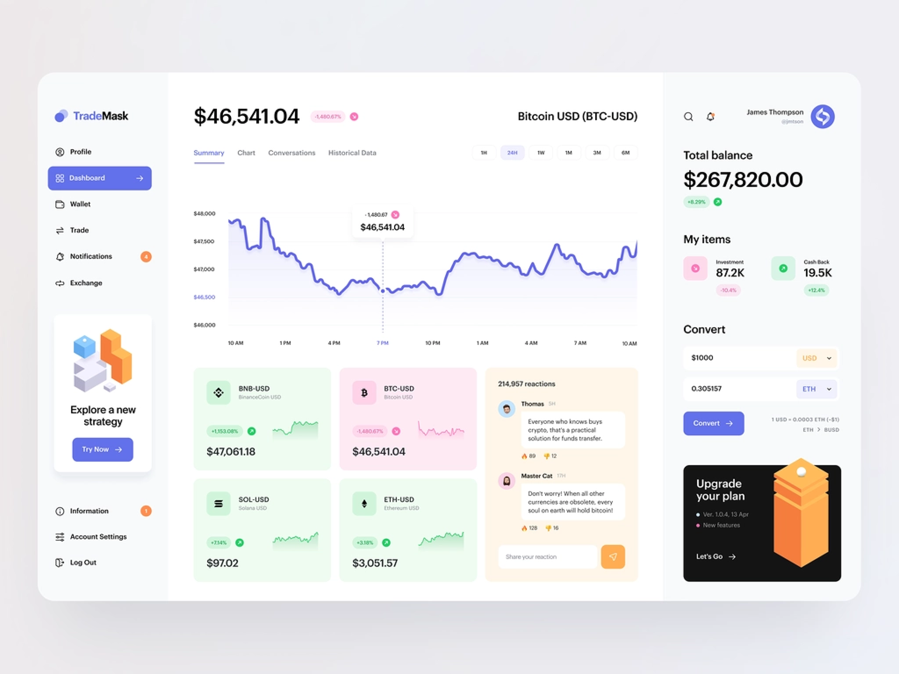

 

    <h1>Gambar 1</h1>

 
 

- Design harus sama persis
- Font nya cari sesuai, beda dikit boleh
- Untuk chart itu data dummy aja, bisa di edit librarynya
- Warna pake "instant eyedropper"
- Setiap tugas harus di kerjakan di file yang berbeda
- Pastiin gak ada konflict atau tabrakan di setiap kerjaan antar team
- Struktur porject harus sama dengan gambar lainnya
- Jangan sampe ada error
- Jangan sampe ada kode yang gak kepake
- Hapus semua console yang ada
- Nama File itu "CamelCase"
- Exstensinya pake ".js" jangan ".jsx"
- Utamakan performa di lighthouse